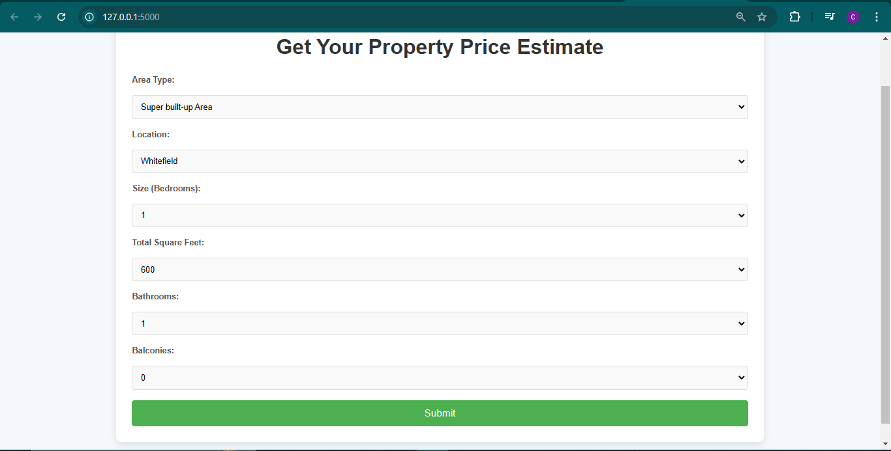

# Real Estate Price Prediction using Flask

## About the Project

This is a Flask-based web application that predicts real estate prices based on user inputs such as area type, location, size, total square feet, number of bathrooms, and balconies.

---

## Application Interface

Here is an example of the web form users can fill out to predict property prices:

---

---

## Application Architecture

The following diagram illustrates the architecture of the app:

---

## Features

- User-friendly web interface for data input.
- Real-time price prediction based on user inputs.
- Displays model accuracy (currently hardcoded as a placeholder).
- Built using Flask for backend and Python for logic.

## Usage

1. Open your browser and navigate to `http://127.0.0.1:5000/`.
2. Enter the property details into the form.
3. Click "Submit" to get the predicted price.

---

## File Structure
